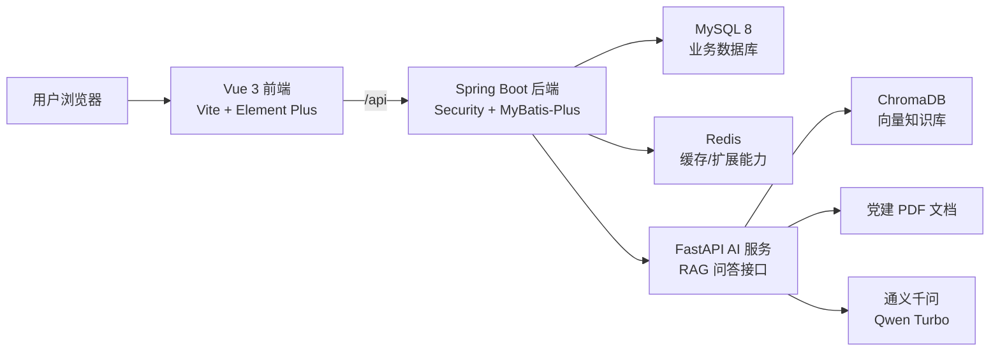

# 智慧党建综合管理平台

> 面向高校与基层党组织的党建业务管理系统，集成党员信息管理、组织生活、党费管理、发展党员流程、组织关系转接、通知公告、志愿服务、思想汇报与 AI 党建知识助手。


## 目录

- [项目概述](#项目概述)
- [核心功能](#核心功能)
- [技术架构](#技术架构)
- [项目结构](#项目结构)
- [环境要求](#环境要求)
- [快速启动](#快速启动)
- [默认账号](#默认账号)
- [常用地址](#常用地址)
- [数据库说明](#数据库说明)
- [AI 知识助手](#ai-知识助手)
- [常见问题](#常见问题)

## 项目概述

智慧党建综合管理平台由三部分组成：

| 模块 | 说明 | 默认端口 |
| --- | --- | --- |
| 前端门户 | Vue 3 + Element Plus 管理端与党员端页面 | `5173` |
| 业务后端 | Spring Boot 3 REST API、认证授权、业务流程 | `8080` |
| AI 助手 | FastAPI + ChromaDB + RAG 党建知识问答 | `8000` |

前端通过 `/api` 代理访问 Java 后端，Java 后端再调用 AI 助手服务。整体适合课程设计、毕业设计、党建信息化原型、全栈项目展示与二次开发。

## 核心功能

| 功能模块 | 功能说明 |
| --- | --- |
| 党员管理 | 党员基础信息维护、查询、列表管理 |
| 党组织管理 | 党支部信息、组织结构与基础数据维护 |
| 组织活动 | 活动发布、报名、签到与活动记录管理 |
| 党费管理 | 党费记录、缴纳提醒、缴费统计 |
| 发展党员 | 入党申请、审批流转、发展报告管理 |
| 组织关系转接 | 转入、转出申请与审核流程 |
| 思想汇报 | 汇报提交、任务分配、审核与归档 |
| 通知公告 | 后台发布、党员端查看、消息管理 |
| 志愿服务 | 志愿活动、报名记录与服务管理 |
| AI 党建助手 | 基于党建 PDF 知识库的智能问答与来源引用 |

## 技术架构



## 项目结构

```text
.
├── README.md
├── 项目使用说明书.md
├── .gitignore
└── 源代码/
    ├── example_db.sql
    ├── smart-party-building/
    │   ├── backend/                 # Spring Boot 业务后端
    │   │   ├── pom.xml
    │   │   └── src/main/
    │   └── frontend/                # Vue 3 前端
    │       ├── package.json
    │       └── src/
    └── promax/
        └── smart-party-ai-service/  # FastAPI + ChromaDB AI 知识助手
            ├── main.py
            ├── requirements.txt
            ├── app/
            ├── knowledge/
            └── vector_db/
```

## 环境要求

| 环境 | 建议版本 |
| --- | --- |
| JDK | 17 |
| Maven | 3.9+ |
| Node.js | 20+ |
| npm | 10+ |
| MySQL | 8.x |
| Python | 3.10 / 3.11 |
| Redis | 6+，可选 |

## 快速启动

### 1. 克隆项目

```bash
git clone https://github.com/666whatcanisay/AI-.git
cd AI-
```

### 2. 准备数据库

创建数据库并导入 SQL：

```bash
mysql -uroot -p -e "CREATE DATABASE example_db CHARACTER SET utf8mb4 COLLATE utf8mb4_unicode_ci;"
mysql -uroot -p --default-character-set=utf8mb4 example_db < 源代码/example_db.sql
```

后端数据库配置位于：

```text
源代码/smart-party-building/backend/src/main/resources/application.yml
```

默认配置：

```yaml
spring:
  datasource:
    url: jdbc:mysql://localhost:3306/example_db
    username: root
    password: 123456
```

### 3. 启动 AI 助手

```bash
cd 源代码/promax/smart-party-ai-service
python -m venv .venv

# Windows
.venv\Scripts\activate

# macOS/Linux
source .venv/bin/activate

pip install -r requirements.txt
cp .env.example .env
python scripts/build_index.py
python main.py
```

`.env` 中需要配置阿里云百炼 API Key：

```env
DASHSCOPE_API_KEY=你的API_KEY
DISTANCE_THRESHOLD=0.6
```

### 4. 启动 Java 后端

```bash
cd 源代码/smart-party-building/backend
mvn spring-boot:run
```

### 5. 启动前端

```bash
cd 源代码/smart-party-building/frontend
npm install
npm run dev
```

访问：

```text
http://localhost:5173
```

## 默认账号

后台管理员：

```text
账号：admin
密码：admin
```

党员端测试账号通常使用党员姓名登录，默认密码：

```text
123456
```

## 常用地址

| 服务 | 地址 |
| --- | --- |
| 前端页面 | <http://localhost:5173> |
| Java 后端 | <http://localhost:8080> |
| Swagger 文档 | <http://localhost:8080/swagger-ui.html> |
| AI 助手页面 | <http://localhost:8000> |
| AI 接口文档 | <http://localhost:8000/docs> |
| AI 状态接口 | <http://localhost:8000/api/status> |

## 数据库说明

项目使用 MySQL 保存业务数据，主要包含党员、组织、活动、党费、审批、汇报、通知、志愿服务等表。仓库中提供 `源代码/example_db.sql` 作为示例数据库文件。

如果迁移到新电脑，建议先确认：

- MySQL 服务已经启动。
- `example_db` 数据库已经创建。
- `application.yml` 中的数据库账号、密码与本机一致。
- 后端启动前，端口 `8080` 未被占用。

## AI 知识助手

AI 助手基于党建 PDF 文档构建本地向量知识库，流程如下：

1. 将 PDF 放入 `knowledge/` 目录。
2. 使用 `python scripts/build_index.py` 构建 ChromaDB 向量索引。
3. 启动 `python main.py`。
4. 前端或 Java 后端通过接口调用 AI 问答。

支持能力：

- PDF 文档解析
- 党建知识语义检索
- 基于通义千问的回答生成
- 返回参考来源
- 独立 AI 页面与 API 文档

## 常见问题

### 前端请求出现 403

请确认已经登录正确角色，必要时清除浏览器 `localStorage` 后重新登录。

### 后端无法启动

请检查 MySQL 是否运行、数据库配置是否正确、JDK 是否为 17、端口 `8080` 是否被占用。

### AI 助手一直显示初始化

首次启动会加载 embedding 模型并连接向量数据库，通常需要等待几十秒。也可以访问 `http://localhost:8000/api/status` 查看状态。

### AI 问答没有命中知识

请确认 `knowledge/` 中存在 PDF，并重新执行：

```bash
python scripts/build_index.py
```

## 仓库信息建议

GitHub 右侧 About 推荐填写：

```text
基于 Vue 3、Spring Boot、FastAPI 与 RAG 知识库的智慧党建综合管理平台，支持党员管理、组织活动、党费、审批流程与 AI 党建问答。
```

推荐 Topics：

```text
vue3, spring-boot, fastapi, mysql, mybatis-plus, rag, chromadb, qwen, party-building, ai-assistant
```

## License

本项目用于学习、课程设计和二次开发参考。如需正式部署，请结合实际业务流程、权限体系和数据安全要求进一步完善。
